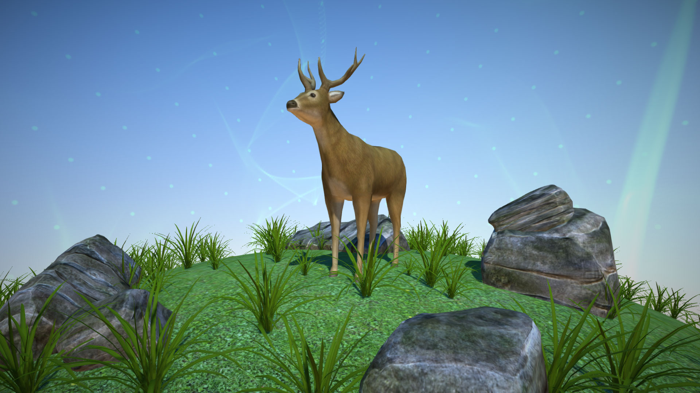

# epic_workshop

il y a un slide deck ici pour l'intro et un peu de contexte: https://slides.com/nicolasbarradeau/three-mon-ami/ 

pré-requis:

* télécharger ou cloner ce repo
* installer [chrome shader editor extension](chrome.google.com/webstore/detail/shader-editor/ggeaidddejpbakgafapihjbgdlbbbpob)
* un serveur local ([xampp](https://www.apachefriends.org/fr/index.html) ou autre)

j'ai extrait certains fichiers de THREE pour éviter de télécharger tout le repo (725Mo au 09/12/16) 
vous pouvez toutefois l'installer à la racine du dossier cloné si vous souhaitez explorer l'API [THREE.js](https://github.com/mrdoob/three.js/) 

### origine des ressources

maillages:

* deer http://www.turbosquid.com/FullPreview/Index.cfm/ID/243576 (aka "bichon")
* grass http://www.turbosquid.com/FullPreview/Index.cfm/ID/703699
* rock http://www.turbosquid.com/FullPreview/Index.cfm/ID/733996

lumières:
j'ai repris quasiment tel quel les lumières de cet exemple
https://threejs.org/examples/webgl_lights_hemisphere.html

environment:
le map d'environnement vient de 
http://www.mettle.com/mettle-skybox-sneek-peek-free-sample/

pour placer les objets, j'ai utilisé l'éditeur de scène de THREE
https://threejs.org/editor/
